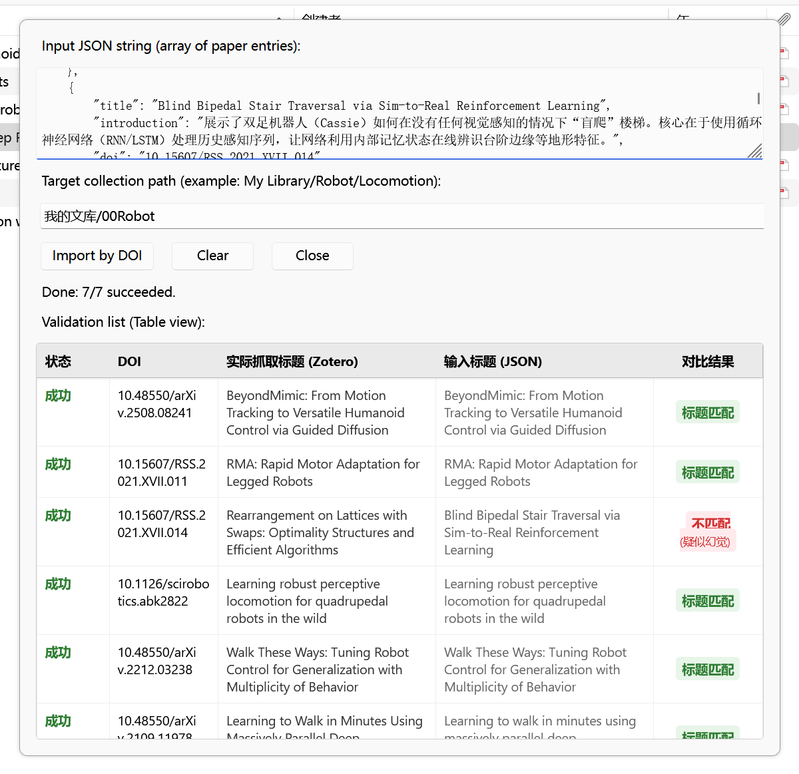

是一个zotero插件。如图。把大模型给的json（含标题、简介、DOI）批量导入，并且查幻觉。

例如，导入 [text](testfile.json)




给你的模型说：

按照这种格式为我返回你找到的文献：

```json
[
    {
        "title": "xxx",
        "introduction": "yyy",
        "doi": "zzz"
    },
    ...
]
```